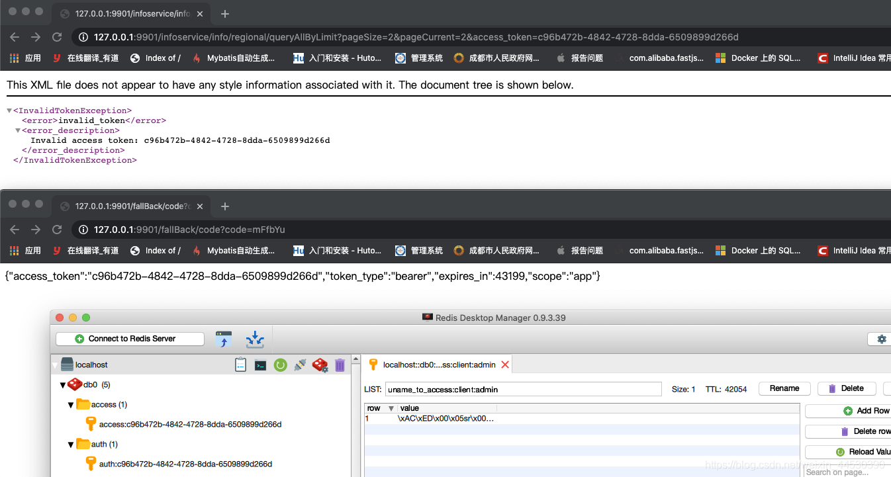
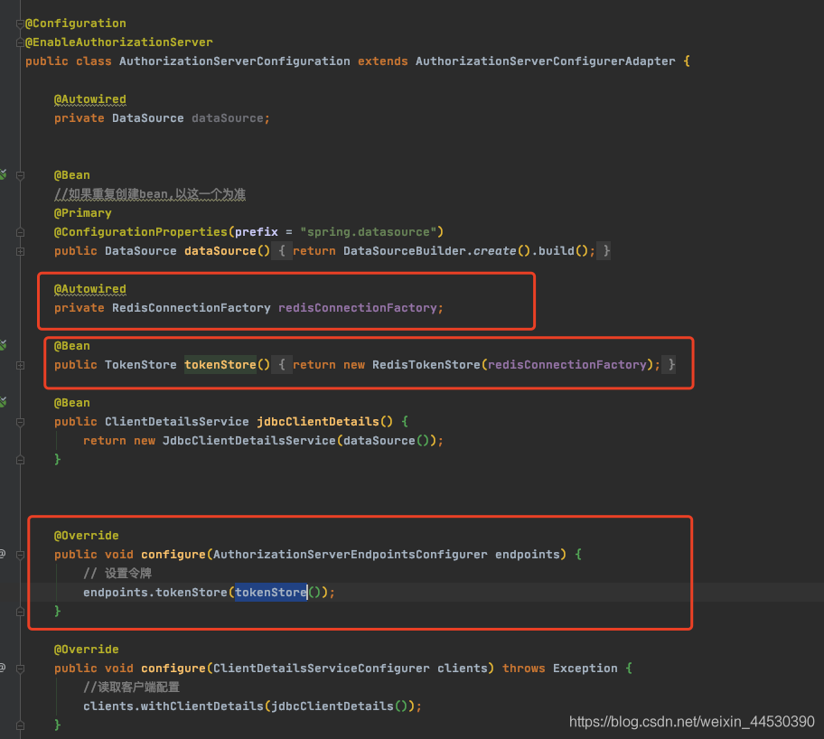
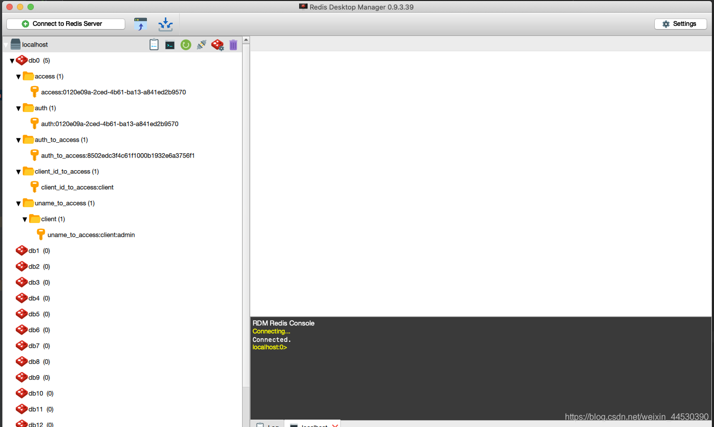
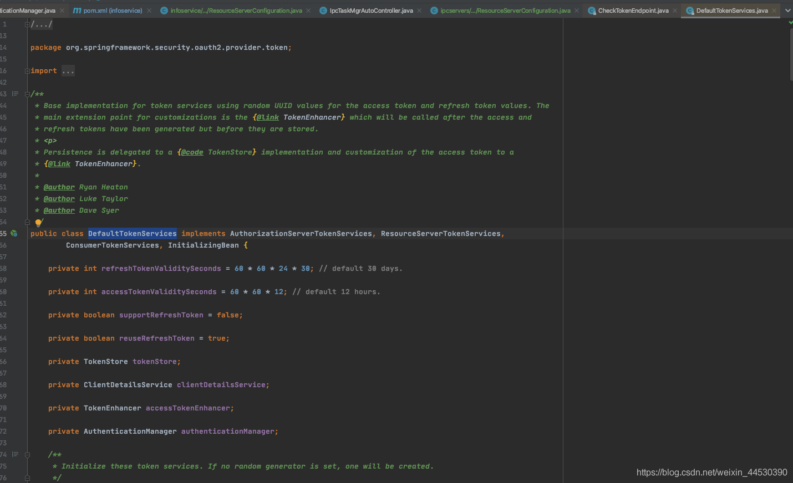
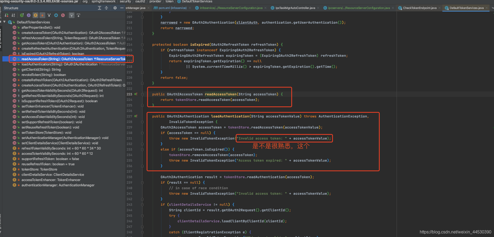
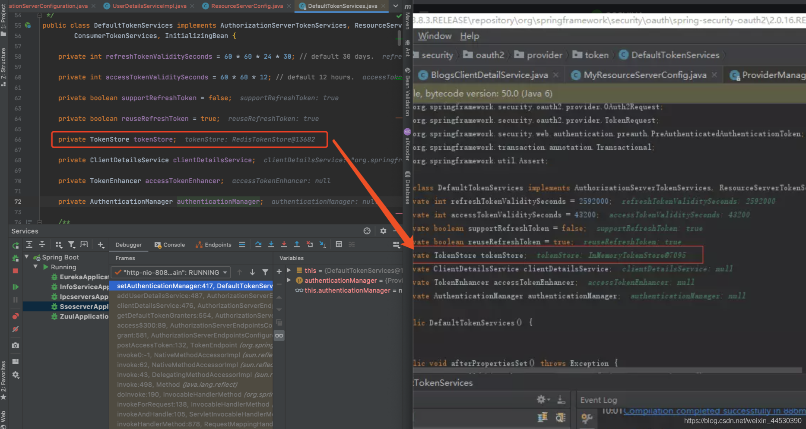
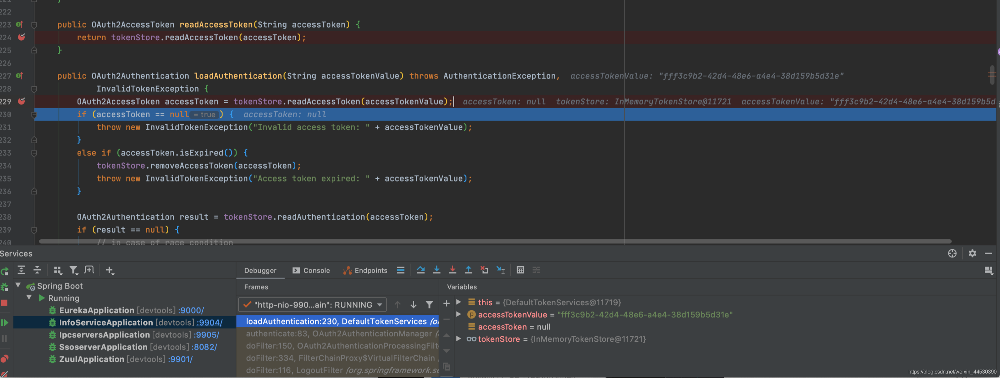
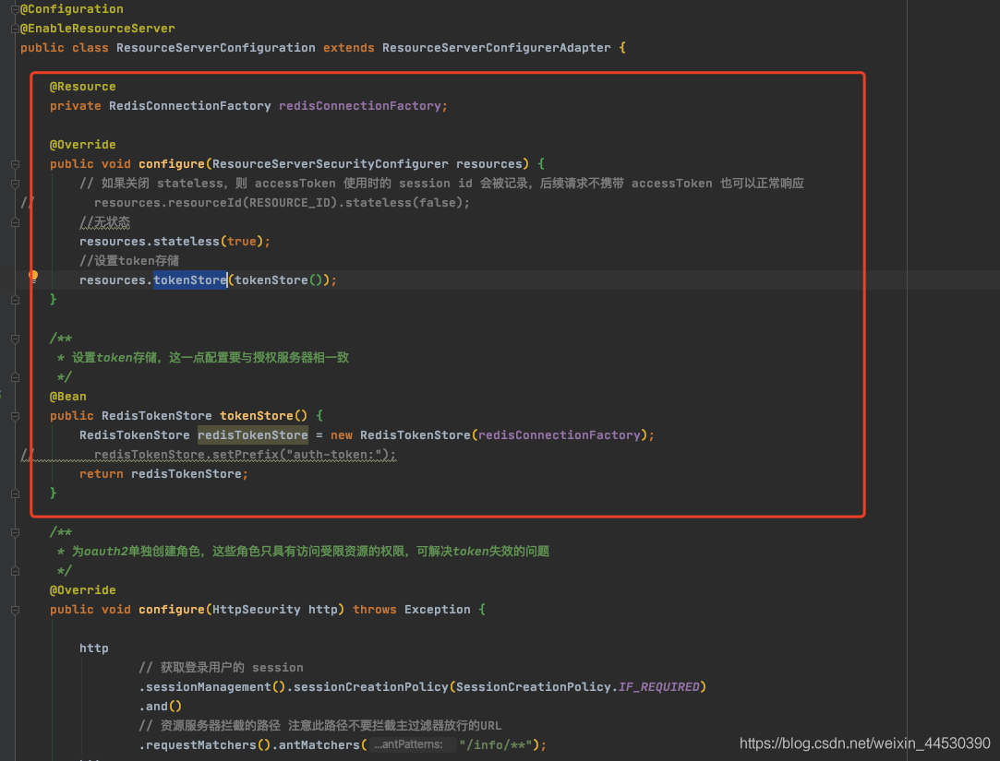
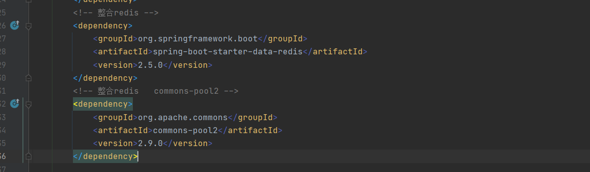
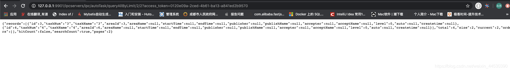

### security+oauth2 在进行资源访问的时候报错401，无效的access_token错误
>博客：https://blog.csdn.net/weixin_44530390/article/details/107768696

#### 内容
参考资料：不分先后
https://my.oschina.net/caidenpan/blog/2978811
https://www.cnblogs.com/hellxz/p/12044482.html
https://www.cnblogs.com/hellxz/p/12044482.html

首先，我大致说下我项目的背景：
是一个简单的springcloud项目，
采用的Eureka+zuul+fegin
认证授权采用的security+oauth2
spring-cloud版本Hoxton.SR6

采用的是授权码模式，前面如何获得code，再获得access_token我就不做过多赘述，网上很多这种单体demo。这里的重点是针对拿到access_token后，请求带着access_token去访问资源，还是出现401的情况。如下图
 

access_token已经存储在redis中去了，并且在有效时间内，但是在我们带着token过去，却说验证码无效。

由于本人也是第一次接触这个security+oauth2，仅看了些视频和网上查找相关资料，所以对这个机制也不是特别熟悉，只有个大致的了解。在认证服务器上，我们有配置一个tokenStore，是返回的***return new RedisTokenStore(redisConnectionFactory);***

如下图

这里是将我们生成的access_token等信息存入到redis中；存入到redis中如下：

也就是说，我们的redis里面有，但是又说无效，说明我们前端传过去的access_token（和redis中一致的）和框架取出来对比的不一致！我们能保证我们的没有问题，那么肯定是框架取出来的不正确！但是我们又找不到他框架是在哪里去取得这个，然后做的对比，通过百度，上面有链接，
获知经过了这么一个类：`DefaultTokenServices.java`

可以下载源码下来看看

我们看下他下面有哪些方法什么的。

在第一次生成access_token时，我断点发现我和别人说的不一样，我这个地方也是redis的tokenstore！

但是我在带着access_token的请求资源时，重点就来了。。。

这就变成内存的tokenstore了。。。。这下原因就清楚了，一个是内存获取access_token，一个是存在redis中的，内存里肯定没有，都是null，问题就在这里了。
那么我们只在认证服务器上配置了一个tokenstore，取得时候的这个tokenstore在哪里配置呢？查找资料发现就应该在资源处再配置一下tokenstore，和认证服务器上的保持一致，就OK了！如下图：

加上这一段之后，启动报错，无法注入RedisConnectionFactory。引入如下依赖解决！

至此，再重启就可以访问到服务器的资源了！
